# UI_README

`stock-research` 的**介面架構文件**。給要動這份程式碼的人看。

> **先讀 `../market-barometer/UI_README.md`。** 渲染、加密、解鎖畫面全部沿用那一側，
> 這份只寫不一樣的地方。

---

## 1. 兩個介面

| | market-barometer | stock-research |
|---|---|---|
| 桌面 TTK 視窗 | 有（`app/`） | 有（`app/`，2026-09-08 追加） |
| 網頁 | 有 | 有 |
| 分頁 | 4（總經×2、大盤×2） | **2**（台股權值股 / 美股權值股） |
| 鎖 | 一層（Password） | **兩層**（Key × 2 配 Password × 2） |
| 買賣建議 | `enforce_lint=True` 擋著，一個字都不能有 | `enforce_lint=False`，**可以有** |
| 更新按鈕 | 「強制重抓」，**會打網路** | 「重新載入」，**不打網路** |
| 背景執行緒 | 有（網路請求要十幾秒） | **沒有**（只讀 SQLite，毫秒級） |

原本這一側沒有桌面程式 —— 用法是「跑完管線、發布、在瀏覽器看」，
沒有「盯著它等資料到期」的需求。後來還是補了（ToDo §1.1 第 22 條）：
兩個 repo 結構刻意對稱，少一個 `app/` 會斷在最顯眼的地方；
而且評分跑完之後，總需要一個不必開瀏覽器、不必解兩道鎖就能看的入口。

**但它跟那一側不是同一種程式。** 那台是操作台，這台是顯示器 ——
差別寫在第 4 節。

---

## 2. 模組互動圖

```mermaid
flowchart TD
    subgraph 本側["stock-research（只有個股專屬的部分）"]
        V["app/views/dashboard.py<br/>StockDashboardWindow"]
        PR["app/presenters/dashboard.py<br/>StockPresenter"]
        ROOT["app/main.py<br/>組裝根"]
        RP["render/page.py<br/>build_tabs / _stock_row"]
        SS["domain/scoring_stock.py<br/>score_short / score_mid<br/>score_long / score_chips_term"]
        CH["datasources/chips_tw.py"]
        RUN["pipeline/run_stock_scores.py<br/>score_series / summarize_window"]
        CFG["config.py<br/>TW_STOCKS / US_STOCKS / ADRS"]
        PUB["tools/publish.py"]
    end

    subgraph 借來["barometer（管線核心，整包沿用）"]
        BR["render.page.render()<br/>render.svg / render.lint"]
        EN["crypto.envelope.seal()<br/>crypto.shell.wrap()"]
        CRED["crypto.credentials"]
        GATE["pipeline.publish_gate"]
        ST["storage.sqlite_repo"]
        WT["domain.weighting"]
        GEO["app.geometry<br/>window_box / shrink_for_frame"]
        PORT["domain.ports<br/>ScoreHistoryRepository"]
        VR["app.presenters.dashboard<br/>ViewRow"]
    end

    RP --> BR
    RUN --> SS
    RUN --> WT
    RUN --> ST
    SS --> CFG
    CH --> ST
    PUB --> RP
    PUB --> GATE
    PUB --> EN
    PUB --> CRED

    V -->|"只呼叫方法"| PR
    V --> GEO
    PR -->|"只認 Protocol"| PORT
    PR --> VR
    PR --> WT
    PR --> CFG
    ROOT -->|"注入"| PR
    ROOT --> ST
    V -.->|"不認識"| ST

    style 借來 fill:#2a2a2a,color:#ddd
```



**灰色那一塊一行都沒重寫。** 兩個站用同一套機制是刻意的：各寫一份的話，
改一邊就會忘記另一邊。這裡只有一組標的與一套個股評分。

分層規矩照舊，而且加了桌面程式之後**多了一份守衛**：
`tests/test_layer_boundary.py` 用 AST 掃描 `app/views/`、`app/presenters/`、
`render/`，確認零個 `storage` 與 `datasources` import。
`app/main.py` 是唯一能同時認得兩邊的地方（組裝根）——
那份測試還會**反過來**檢查它真的有 import 資料層，沒有的話代表接線
偷偷搬到表現層去了。

---

## 3. 畫面對照表

<details>
<summary><b>桌面程式（點開）</b></summary>

| 畫面元素 | 實作位置 | 說明 |
|---|---|---|
| 主視窗 | `app/views/dashboard.py` → `StockDashboardWindow` | ttkbootstrap `bs.Window`，主題 `darkly` |
| 視窗尺寸 | `barometer.app.geometry.window_box()` | **直接沿用那一側**，不另寫一份：上下 3%~87%、左右 3%~97% |
| 外框修正 | `StockDashboardWindow._fit_outer_edges` | 扣掉標題列厚度，讓看得到的邊界落在規格上 |
| 「重新載入」按鈕 | `StockDashboardWindow.btn` → `_reload_all` | **不打網路**，只重讀本機資料庫 |
| 兩個分頁 | `app/presenters/dashboard.py` → `TAB_TITLES` | 台股權值股 / 美股權值股 |
| 各分頁表格 | `StockDashboardWindow.trees[key]`，`COLUMNS` | 標的／總分／資料日期／頻率／三期分項與但書 |
| 三期與籌碼 | `StockPresenter._terms()` | **缺 key = 資料不足**，不是 0 分 |
| 狀態列 | `StockPresenter.status()` | 「N 檔，資料日期 M 種：…」，不是「最後更新」 |
| 頁尾免責 | `views/dashboard.py` → `DISCLAIMER` | 桌面也是一個出口，一樣要掛 |
| 圖示 | `app/main.py` → `_apply_icon` + `_set_taskbar_identity` | AppUserModelID 與 market-barometer **刻意不同**，否則工作列會併成同一格 |

</details>

<details>
<summary><b>網頁（點開）</b></summary>

| 畫面元素 | 實作位置 | 說明 |
|---|---|---|
| 兩道解鎖畫面 | `barometer/crypto/shell.html`（借用），`tools/publish.py` 包兩層 | 外層 Key 解開後，裡面還是一份密文，再用 Password 解 |
| 頁面骨架 | `barometer/render/page.py` → `render(enforce_lint=False)` | **`False` 是這一側唯一的行為差異** |
| 分頁組裝 | `src/research/render/page.py` → `build_tabs()` | 回傳 2 個 `Tab` |
| 一列個股 | `src/research/render/page.py` → `_stock_row()` | 短／中／長三期 + 籌碼面 |
| 台股說明段 | `TW_INTRO` | 顯示單位「張」 |
| 美股說明段 | `US_INTRO` | 顯示單位「股」，並說明沒有三大法人資料 |
| 頁尾免責 | `FOOTER` | 每一頁都掛「不構成投資建議」 |
| 「資料不足」 | `domain/scoring_stock.py` → `INSUFFICIENT` | **不是 0 分，是一個字串**，走不同的渲染分支 |
| 薄流動性但書 | `config.py` → `THIN_LIQUIDITY` | 命中的標的照算，但列上掛註記 |

</details>

---

## 4. 四個 UI 決策，與它們的理由

<details>
<summary><b>一、「資料不足」必須看得出來，不能長得像分數（點開）</b></summary>

`SPCX` 2026-06-12 才上市，只有 59 根日 K。中期要 60 根、長期要 200 根。

硬算的話會得到一個數字，而那個數字**長得跟其他十四檔一模一樣**，沒有人會發現
那格是空的 —— 更糟的是 0 分會被平均進總分，把一檔「不知道」拉成一檔「很差」。

所以：

```
scoring_stock.score_mid(closes)  → TermScore(score=INSUFFICIENT, ...)
                                    ↑ 字串 "資料不足"，不是 0.0
render._stock_row()              → 走不同分支，顯示灰字，不進平均
```

**這是介面決策，不只是資料決策。** 分數與「沒有分數」在畫面上必須是兩種東西。

</details>

<details>
<summary><b>二、籌碼面那一維，美股是「不存在」不是「0」（點開）</b></summary>

美股與 ADR 沒有台灣的三大法人資料。那一維在美股分頁上**整欄不出現**，
而不是出現一個 0。同一個理由：0 是一個評價，空白才是誠實的。

</details>

<details>
<summary><b>三、同一個籌碼數字，三種讀法（點開）</b></summary>

三大法人買賣超這個數字，在三個地方意思不一樣：

| 套在 | 讀法 |
|---|---|
| **個股**（這個 repo） | 最直覺的那個讀法：法人在買這家公司還是在賣 |
| **ETF**（market-barometer） | 多半是套利與申贖，不是看好看壞 |
| **加權指數**（market-barometer） | 全市場資金流向 |

所以兩個 repo 的說明文字不能互抄。`TW_INTRO` 寫的是個股的讀法。

</details>

<details>
<summary><b>四、桌面程式是顯示器，不是操作台（點開）</b></summary>

`market-barometer` 的桌面程式有「強制重抓」，按下去會打十幾個網路請求。
這一側**刻意沒有**那顆按鈕。

分數是 `tools/fetch_stocks.py` → `tools/score_stocks.py` 跑完寫進去的。
在視窗裡放一顆「重抓」只會讓人以為按了就會有新資料 —— 名字要對得上行為。
所以這裡的按鈕叫「重新載入（不打網路）」，它只重讀 SQLite。

**連帶的簡化：沒有背景執行緒。**

| | market-barometer | 這一側 |
|---|---|---|
| 最慢的動作 | 十幾個網路請求，十幾秒 | 讀 15 檔 SQLite，毫秒 |
| 所以 | 背景執行緒 + `queue.Queue` + `after()` 輪詢 | 直接在主執行緒做完 |

**沒有慢操作就不要有併發。** 丟到執行緒裡只是多一層會出錯的地方。
保留的是關窗處理：`after` 的 id 要記下來、關窗時全部取消，
少了這步關窗後那些 callback 會炸 `invalid command name`。

</details>

---

## 5. 桌面程式：互動流程與打包

<details>
<summary><b>開視窗（點開）</b></summary>

```
main() → _set_taskbar_identity()     ← 一定要在 bs.Window() 之前
       → _enable_dpi_awareness()     ← 同上
       → bs.Window(iconphoto=None)   ← 不傳的話 ttkbootstrap 的 logo 會蓋掉 .ico
       → _apply_icon()
       → StockDashboardWindow(root, StockPresenter(repo))
           → window_box() 算尺寸 → geometry()
           → _make_tree() ×2
           → _reload_all() → Presenter.load(tab) ×2 → repo.get_scores()
           → _fit_outer_edges()
```

**整條路徑零次網路請求**，而且沒有背景執行緒。

</details>

<details>
<summary><b>切分頁／重新載入（點開）</b></summary>

```
<<NotebookTabChanged>> → _reload_current() → _fill(key) → Presenter.load(key)
按鈕                    → _reload_all()     → 兩個分頁都重讀
```

兩條路都只讀 SQLite。

</details>

<details>
<summary><b>關窗（點開）</b></summary>

```
WM_DELETE_WINDOW → on_close()
   → _closing = True
   → after_cancel(每一個記下來的 id)   ← 少了這步會炸 invalid command name
   → root.destroy()
```

不必 join 執行緒 —— 這一側沒有背景執行緒。

</details>

<details>
<summary><b>打包（點開）</b></summary>

```powershell
$env:PYTHONIOENCODING = "utf-8"
$env:PYTHONPATH = "D:\Research\stock-research\src;D:\Research\market-barometer\src"
& $py -m PyInstaller --clean --noconfirm packaging/research.spec
```

`packaging/research.spec` 跟 market-barometer 那支最大的差別：
**`pathex` 要同時給兩個 repo 的 `src`**。少了 market-barometer 那一條，
build 會成功、exe 會在啟動時死於 `No module named 'barometer'`。
spec 開頭有一段檢查，找不到隔壁 repo 就直接讓 build 失敗，
而不是產出一顆跑不起來的 exe。

**驗收不是 `exit 0`** —— 看的是「build log 裡零個 `Library not found`」
加上「實際啟動 exe，視窗真的出現」。兩種情況都 exit 0。

實測（2026-09-08）：41.9 MB，冷啟動 11.7 秒、暖啟動約 5 秒。

</details>

---

## 6. 發布流程

```
tools/publish.py
   → run_stock_scores 的結果 → build_tabs()      ← 2 個分頁
   → barometer.render.page.render(enforce_lint=False)
   → publish_gate.should_publish(明文)            ← 比對明文指紋，不是密文
        └ 沒變 → 結束，docs/ 一個字都不動
   → seal() 內層（Password × 2）
   → seal() 外層（Key × 2）
   → shell.wrap()
   → 寫 docs/index.html
   → python ../market-barometer/tools/verify_publish.py stock-research
```

憑證讀自 `%STOCKDATA_ROOT%\secrets\publish.json` 的 `stock-research` 區塊，
**不在這個 repo 裡，也不可以放進來** —— 這是 public repo，進了版控就撤不回來。

---

## 7. 安全性的實話

⚠️ **兩層鎖實質上是一層。**

外層 Key 與 `market-barometer` 的 Password 有字串重疊，而那組 Password 本來就要
印在文章上給讀者用。它一流出，這邊的外層 Key 就跟著流出。**安全性等於內層那兩個
Password 的強度。**

而且密文放在 public repo，任何人可以下載後離線慢慢猜，**沒有速率限制**。

**放進來的東西要能承受萬一被看到。**

---

## 8. 做得到與做不到

<details>
<summary><b>做得到</b></summary>

- **兩個介面**：桌面程式（`.exe`）與加密網頁，同一份分數
- 兩個分頁顯示 15 檔標的的短／中／長三期評分
- 台股多一個籌碼面維度
- 五日加權（權重與大盤共用同一組）
- 資料不足的格子顯示成「資料不足」而不是 0 分
- 薄流動性標的照算並掛註記
- 可以把分數翻成一個行動描述
- 依螢幕解析度決定視窗大小（沿用 market-barometer 的算式）

</details>

<details>
<summary><b>做不到（刻意的）</b></summary>

- **桌面程式不打網路。** 它只顯示管線寫好的分數，沒有「重抓」這個動作。
- **桌面沒有走勢圖。** 圖只在網頁那一側。
- **網頁不會自己更新。** 靜態快照。
- **不能在畫面上改標的清單。** 那在 `config.py`，改要動程式。
- **「可以有建議」不等於可以隨便寫。** 這一側仍然不產生「保證」「一定」這種
  語氣，每一頁還是掛「不構成投資建議」。差別只在它可以把分數翻成一個行動
  描述，`market-barometer` 連那句都不生成。

</details>
